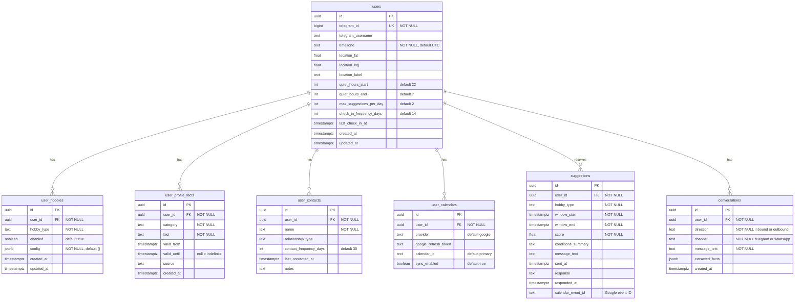

# Kairos — Database ER Diagram

PostgreSQL 16 schema (Alembic revision `001_initial`). All `user_id` foreign keys cascade on delete.

## Relationships

| Parent | Child | Cardinality | Notes |
|--------|-------|-------------|-------|
| `users` | `user_hobbies` | 1 : 0..N | `UNIQUE(user_id, hobby_type)` |
| `users` | `user_profile_facts` | 1 : 0..N | Learning layer; validity windows |
| `users` | `user_contacts` | 1 : 0..N | Social/contact tracking |
| `users` | `user_calendars` | 1 : 0..N | OAuth calendar connections |
| `users` | `suggestions` | 1 : 0..N | Proactive activity suggestions |
| `users` | `conversations` | 1 : 0..N | Message log |

## Logical flows

- **Scheduler** reads `users`, `user_hobbies`, `user_profile_facts`, `user_calendars` → writes `suggestions`
- **Learning agent** reads/writes `conversations` → extracts facts into `user_profile_facts`
- **`suggestions.calendar_event_id`** stores a Google Calendar event ID (not an FK)
